# The Urban Fabric as Palimpsest

This project investigates the history of 20th century urban design paradigms in Basel, focusing on the impact of car-centered planning projects – the so-called _Korrektionspläne_. The data in this repository is openly available to everyone and is intended to support reproducible research.

[-AGPL--3.0-orange.svg>)](https://github.com/mtwente/palimpsest-bs/blob/main/LICENSE-AGPL.md)
[-CC%20BY%204.0-brightgreen.svg>)](https://github.com/mtwente/palimpsest-bs/blob/main/LICENSE-CCBY.md)

## How to Cite

These data are openly available to everyone and can be used for any research or educational purpose. If you use this data in your research, please cite as specified in [CITATION.cff](CITATION.cff).

## Repository Structure

The structure of this repository follows the [Advanced Structure for Data Analysis](https://the-turing-way.netlify.app/project-design/project-repo/project-repo-advanced.html) of _The Turing Way_ and is organized as follows:

- `analysis/`: scripts and notebooks used to analyze the data
- `assets/`: images, logos, etc. used in the README and other documentation
- `build/`: scripts and notebooks used to build the data
- `data/`: data files
- `docs/`: documentation for the data and the repository
- `project-management/`: project management documents (e.g., meeting notes, project plans, etc.)
- `src/`: source code for the data (e.g., scripts used to collect or process the data)
- `test/`: tests for the data and source code
- `report.md`: a report describing the analysis of the data

## Data Description

- TODO Describe the data in this repository, including what it represents, how it was collected or obtained, any preprocessing or cleaning that was done, and any limitations or potential biases.
- TODO Data models, including field names, descriptions, and controlled values, should be clearly documented in a static document that is maintained with the data and is part of the products.
- TODO All rights and intellectual property issues should be clearly documented. Where possible, data and products should be released under open licenses (Creative Commons, GNU, BSD, MPL).

```mermaid.js
flowchart TD
    C --> D
    subgraph Road Network
    A[City Boundary] -->|Download from OSM| B([Basel Transport Network])
    A2[Road Network] -->|Download from Swisstopo| B
    B --> |Filter Features| C([Basel Road Network])
    end
    C -->|Calculate Bearings| D3
    subgraph Road Area Geometries
    L[Ground Cover Data] -->|Download from Canton| M([Transport Geometries])
    M --> |Filter Features| N([Way Area Polygons])
    N --> |Fix and Dissolve| N
    end
    N --> |Transform to Lines| X
    N --> Z
    subgraph Lines Across Road Surface
    X[Way Area Outlines] -->|25m Transects| Y([Perpendicular Lines])
    Y -->|Clip to Polygons| Z([Surface Transect Lines])
    end
    Z -->|Filter Excess Roads| D
    subgraph Road Width
    D[Transects within Road Network] --> D4
    D --> |Calculate Length| D
    D --> |Calculate Bearings| D3
    D3[Angle Difference] -->|Filter +/- 90°| D4([Road Width Line Features])
    C --> |Filter Geometry Outliers| D4
    end
```

## Support

This project is maintained by [@mtwente](https://github.com/mtwente). Please understand that we can't provide individual support via email. We also believe that help is much more valuable when it's shared publicly, so more people can benefit from it.

| Type                                   | Platforms                                                                  |
| -------------------------------------- | -------------------------------------------------------------------------- |
| 🚨 **Bug Reports**                     | [GitHub Issue Tracker](https://github.com/mtwente/palimpsest-bs/issues)    |
| 📊 **Report bad data**                 | [GitHub Issue Tracker](https://github.com/mtwente/palimpsest-bs/issues)    |
| 📚 **Docs Issue**                      | [GitHub Issue Tracker](https://github.com/mtwente/palimpsest-bs/issues)    |
| 🎁 **Feature Requests**                | [GitHub Issue Tracker](https://github.com/mtwente/palimpsest-bs/issues)    |
| 🛡 **Report a security vulnerability** | See [SECURITY.md](SECURITY.md)                                             |
| 💬 **General Questions**               | [GitHub Discussions](https://github.com/mtwente/palimpsest-bs/discussions) |

## Roadmap

No changes are currently planned.

## Contributing

All contributions to this repository are welcome! If you find errors or problems with the data, or if you want to add new data or features, please open an issue or pull request. Please read [CONTRIBUTING.md](CONTRIBUTING.md) for details on our code of conduct and the process for submitting pull requests.

## Versioning

We use [SemVer](http://semver.org/) for versioning. The available versions are listed in the [tags on this repository](https://github.com/mtwente/palimpsest-bs/tags).

## Authors and acknowledgment

- **Moritz Twente** - _Initial work_ - [mtwente](https://github.com/mtwente)

See also the list of [contributors](https://github.com/mtwente/palimpsest-bs/graphs/contributors) who contributed to this project.

## License

The data in this repository is released under the Creative Commons Attribution 4.0 International (CC BY 4.0) License - see the [LICENSE-CCBY](LICENSE-CCBY.md) file for details. By using this data, you agree to give appropriate credit to the original author(s) and to indicate if any modifications have been made.

The code in this repository is released under the GNU Affero General Public License v3.0 - see the [LICENSE-AGPL](LICENSE-AGPL.md) file for details. By using this code, you agree to make any modifications available under the same license.
